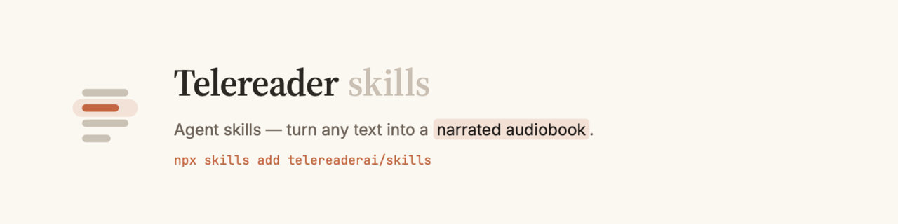

<p align="center">
  
</p>

# Telereader skills

Agent skills for [Telereader](https://telereader.ai). Paste an article, a
markdown doc, or a file, and get back an openable reader URL — the text read
aloud, with the words lit up in time with the voice.

## Available skills

| Skill | Description |
|---|---|
| [telereader](skills/telereader/) | Submit text/markdown (or a file) and get back an openable reader URL. One-time device-grant auth; a free caller is never paywalled. |

## Install

```bash
npx skills add telereaderai/skills
```

This installs the skill into your coding agent (Claude Code, Cursor, Codex,
Copilot, Cline, Windsurf, …). Then onboard once — the script prints a browser
approval link to approve, and saves a reading-scoped token:

```bash
# path is printed by the installer, e.g.
#   ~/.config/agents/skills/telereader/scripts/onboard
<skill_dir>/scripts/onboard
```

After that, ask your agent to read text aloud and it will hand you a link.

## Requirements

- **curl** — HTTP client (usually preinstalled)
- **jq** — JSON processor (`brew install jq` / `apt install jq`)

## In a chat assistant instead? Use the MCP server

If you're in Claude or ChatGPT (or any MCP client) rather than a coding agent,
connect the hosted **MCP server** — no skill install needed:

- **URL:** `https://telereader.ai/api/mcp` (Streamable HTTP, OAuth)
- Exposes a **`generate_audiobook`** tool.
- Per-client setup: <https://telereader.ai/docs/api/agents>

The skill and the MCP server hit the same API, on the same account, and return
the same reader URL.

## License

[MIT](LICENSE).
